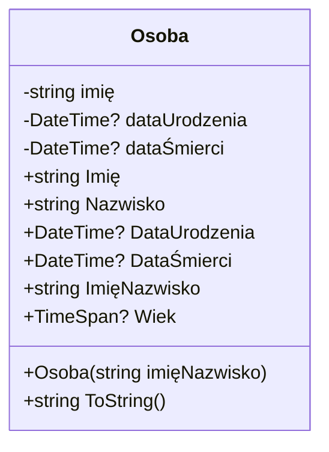

# Zadanie 1 - Klasa Osoba

## Opis zadania

Utworzyć klasę `Osoba`, zawierającą następujące składowe:

### Konstruktor

- Wymagający argumentu `string imięNazwisko` - zapisujemy wartość jako właściwość `ImięNazwisko`

### Pola

- `string imię`
- `string Nazwisko` (może być publiczne, jeśli nie buforujemy `ImięNazwisko` tylko sklejamy w geterze)
- `DateTime? DataUrodzenia = null` (może być publiczne)
- `DateTime? DataŚmierci = null` (może być publiczne)

### Publiczne właściwości

#### `string Imię`

- Przy zapisie sprawdza, czy `value` nie jest puste i zwraca w takim wypadku wyjątek

#### `string ImięNazwisko`

- Przy odczycie skleja imię i nazwisko z użyciem spacji
- Przy zapisie rozbija napis względem spacji i traktuje pierwszą składową jako `Imię`, a ostatnią jako `Nazwisko`
- W wypadku jednoczłonowego `value` ustawia puste `Nazwisko`

#### `TimeSpan? Wiek` (tylko do odczytu)

- Oblicza wiek na podstawie `DataUrodzenia` i `DataŚmierci`, lub obecnego momentu, jeśli `DataŚmierci` jest `null`
- Jeśli `DataUrodzenia` jest `null`, to zwraca `null`

## Diagram klasy



## Szczegóły implementacji

### Pola prywatne

- **`imię`** - przechowuje wartość imienia z walidacją przy zapisie
- **`dataUrodzenia`** - opcjonalna data urodzenia z walidacją względem daty śmierci
- **`dataŚmierci`** - opcjonalna data śmierci z walidacją względem daty urodzenia

Konstruktor przyjmuje parametr `imięNazwisko` typu `string` i automatycznie parsuje go przy użyciu właściwości `ImięNazwisko`, dzieląc tekst na imię i nazwisko.

### Właściwości z walidacją

#### `Imię`

- **Getter**: zwraca wartość pola `imię`
- **Setter**: sprawdza czy wartość nie jest pusta/null/whitespace, w przeciwnym przypadku rzuca `ArgumentException`

#### `Nazwisko`

- **Inicjalizacja**: domyślnie ustawione na pusty string (`string.Empty`)
- **Brak walidacji**: może być puste (obsługuje przypadki jednoimiennych osób jak "Madonna")
- **Modyfikowane przez**: setter właściwości `ImięNazwisko`

#### `DataUrodzenia`

- **Getter**: zwraca wartość pola `dataUrodzenia`
- **Setter**: waliduje czy data urodzenia nie jest późniejsza niż data śmierci (jeśli obie są ustawione)

#### `DataŚmierci`

- **Getter**: zwraca wartość pola `dataŚmierci`
- **Setter**: waliduje czy data śmierci nie jest wcześniejsza niż data urodzenia (jeśli obie są ustawione)

#### `ImięNazwisko`

- **Getter**: łączy imię i nazwisko spacją, używając `Trim()` do usunięcia nadmiarowych spacji
- **Setter**:
  - Parsuje tekst dzieląc go po spacjach z użyciem `StringSplitOptions.RemoveEmptyEntries`
  - Pierwsza część staje się imieniem
  - Ostatnia część staje się nazwiskiem
  - Jeśli jest tylko jedna część, nazwisko pozostaje puste
  - Waliduje czy wartość nie jest pusta

#### `Wiek` (tylko do odczytu)

- Zwraca `null` jeśli `DataUrodzenia` nie jest ustawiona
- Oblicza różnicę między datą końcową a datą urodzenia
- Data końcowa to `DataŚmierci` lub bieżący moment (`DateTime.Now`)

### Dodatkowe metody

#### `ToString()`

Zwraca sformatowaną reprezentację osoby zawierającą:

- Imię i nazwisko
- Daty urodzenia i śmierci (jeśli dostępne) w formacie `yyyy-MM-dd`
- Wiek w latach (obliczony jako `TotalDays / 365.25`)

**Przykład wyjścia**: `"Jan Kowalski (ur. 1990-05-15) - 34 lata"`

### Obsługa błędów

Klasa rzuca `ArgumentException` w następujących przypadkach:

- Próba ustawienia pustego imienia
- Próba ustawienia pustej wartości `ImięNazwisko`
- Próba ustawienia daty urodzenia późniejszej niż data śmierci
- Próba ustawienia daty śmierci wcześniejszej niż data urodzenia

## Testy aplikacji

### Dostępne testy w Program.cs

Zestaw testów weryfikujących funkcjonalność klasy `Osoba` znajduje się w pliku Program.cs:

#### Testy podstawowej funkcjonalności

1. **Test 1: Podstawowe tworzenie osoby**
   - Tworzy osobę "Jan Kowalski"
   - Sprawdza właściwości `Imię`, `Nazwisko`, `ImięNazwisko`
   - Weryfikuje metodę `ToString()`

2. **Test 2: Jednoczłonowe imię**
   - Tworzy osobę "Madonna" (bez nazwiska)
   - Sprawdza czy `Nazwisko` jest puste
   - Weryfikuje poprawne parsowanie ImięNazwisko

3. **Test 3: Wieloczłonowe imię i nazwisko**
   - Tworzy osobę "Jan Maria Kowalski Nowak"
   - Sprawdza czy `Imię` to pierwsza składowa ("Jan")
   - Sprawdza czy `Nazwisko` to ostatnia składowa ("Nowak")

4. **Test 4: Osoba z datami życia**
   - Tworzy Adama Mickiewicza z datami urodzenia (1798) i śmierci (1855)
   - Sprawdza obliczanie wieku w momencie śmierci
   - Weryfikuje formatowanie w `ToString()`

5. **Test 5: Osoba żyjąca**
   - Tworzy osobę "Anna Nowak" z datą urodzenia (1990)
   - Sprawdza obliczanie aktualnego wieku
   - Testuje osobę bez daty śmierci

#### Testy walidacji

6. **Test 6: Walidacja dat** (`TestWalidacjiDat()`)
   - ✅ Data śmierci wcześniejsza niż urodzenia
   - ✅ Data urodzenia późniejsza niż śmierci
   - ✅ Poprawne daty (1950-2020)
   - ✅ Ta sama data urodzenia i śmierci (przypadek graniczny)

7. **Test 7: Walidacja tekstu** (`TestWalidacji()`)
   - ✅ Pusté imię (setter `Imię`)
   - ✅ Pusté `ImięNazwisko` w konstruktorze
   - ✅ Osoba bez daty urodzenia (właściwość `Wiek` zwraca `null`)

### Jak uruchomić testy

#### Metoda 1: Visual Studio / Visual Studio Code

```bash
# W terminalu w katalogu projektu:
dotnet run
```

#### Metoda 2: Bezpośrednie uruchomienie

```bash
# Kompilacja:
dotnet build

# Uruchomienie:
dotnet bin/Debug/net[VERSION]/[PROJECT_NAME].dll
```

#### Metoda 3: Z poziomu IDE

1. Otwórz projekt w Visual Studio lub VS Code
2. Ustaw `Program.cs` jako główny plik startowy
3. Naciśnij F5 lub użyj opcji "Run"/"Debug"

### Oczekiwane rezultaty testów

**Testy pozytywne** powinny wyświetlić:

- Imiona i nazwiska osób z poprawnymi właściwościami
- Daty urodzenia i śmierci w formacie yyyy-MM-dd
- Obliczony wiek w latach (lub `null` dla osób bez daty urodzenia)
- Sformatowane przedstawienie osoby przez `ToString()`

**Testy walidacji** powinny wyświetlić:

- ✅ Komunikaty o wykryciu nieprawidłowych wartości
- Szczegóły błędów z `ArgumentException`
- Wszystkie testy walidacji powinny być oznaczone jako "✅ Wykryto..."

**Przykład oczekiwanego wyjścia:**

```bash
=== Test klasy Osoba ===

Test 1: Tworzenie osoby 'Jan Kowalski'
Imię: 'Jan'
Nazwisko: 'Kowalski'
ImięNazwisko: 'Jan Kowalski'
ToString(): Jan Kowalski

Test 4: Osoba z datami życia
Data urodzenia: 1798-12-24
Data śmierci: 1855-11-26
Wiek w momencie śmierci: 56.9 lat
ToString(): Adam Mickiewicz (ur. 1798-12-24 - zm. 1855-11-26) - 56 lat

...

✅ Wykryto błędną datę śmierci: Data śmierci nie może być wcześniejsza...
✅ Wykryto pusté imię: Imię nie może być puste!
```

Program kończy się komunikatem "Naciśnij dowolny klawisz aby zakończyć..." i czeka na input użytkownika.
