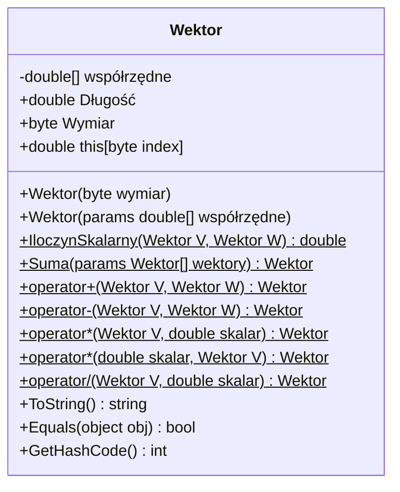

# Zadanie 2 - Klasa Wektor

## Opis zadania

Zbudować klasę `Wektor` reprezentującą wektor o dowolnym wymiarze.

### Pola

- `double[] współrzędne` - wartości na poszczególnych współrzędnych

### Konstruktory

- `Wektor(byte wymiar)` i/lub `Wektor(params double[] współrzędne)`

### Publiczne właściwości

#### `double Długość` (tylko do odczytu)

- Można skorzystać z `IloczynSkalarny(this, this)`

#### `byte Wymiar` (tylko do odczytu)

- Albo osobne pole, albo po prostu długość tablicy współrzędnych

#### Indeksator `this[byte]`

- Umożliwia dostęp do współrzędnych wektora

### Statyczne metody

#### `double(?) IloczynSkalarny(Wektor V, Wektor W)`

- Należy skontrolować wymiar obu wektorów
- Jeśli wymiar jest różny, zwracamy `double.NaN` (albo `null`?) lub wyjątek

#### `Wektor Suma(params Wektor[] Wektory)`

- Tak jak wyżej - skontrolować wymiar...

### Operatory

#### Operatory arytmetyczne

- `operator +(Wektor, Wektor)` - zwracający nową instancję, będącą sumą wektorów
- `operator -(Wektor, Wektor)` - zwracający nową instancję, będącą różnicą wektorów

#### Operatory skalarne

- `operator *(Wektor, double)` i `operator *(double, Wektor)` - zwracające nową instancję, będącą wektorem wymnożonym przez skalar
- `operator /(Wektor, double)` - zwracający nową instancję, będącą wektorem podzielonym przez skalar

## Diagram klasy

## Szczegóły implementacji

### Pola prywatne

- **`współrzędne`** - tablica `double[]` przechowująca wartości współrzędnych wektora

### Implementacja konstruktorów

#### `Wektor(byte wymiar)`

Tworzy wektor o określonym wymiarze wypełniony zerami.

- **Walidacja**: sprawdza czy wymiar > 0, w przeciwnym przypadku rzuca `ArgumentException`
- **Inicjalizacja**: tworzy tablicę `double[wymiar]` z wartościami domyślnymi (zera)

#### `Wektor(params double[] współrzędne)`

Tworzy wektor z podanych współrzędnych.

- **Walidacja**: sprawdza czy parametr nie jest `null` i czy zawiera co najmniej jeden element
- **Kopiowanie**: wykonuje głęboką kopię tablicy za pomocą `Array.Copy()` dla bezpieczeństwa danych

### Właściwości

#### `Długość` (tylko do odczytu)

- **Obliczanie**: wykorzystuje wzór matematyczny √(x₁² + x₂² + ... + xₙ²)
- **Implementacja**: iteruje przez wszystkie współrzędne, sumuje kwadraty i zwraca pierwiastek
- **Typ zwracany**: `double`

#### `Wymiar` (tylko do odczytu)

- **Źródło**: długość tablicy `współrzędne.Length`
- **Rzutowanie**: na `byte` zgodnie z wymaganiami
- **Typ zwracany**: `byte`

#### Indeksator `this[byte index]`

- **Getter**: zwraca wartość współrzędnej na pozycji `index`
- **Setter**: ustawia wartość współrzędnej na pozycji `index`
- **Walidacja**: sprawdza czy indeks jest w zakresie tablicy, rzuca `IndexOutOfRangeException` w przypadku błędu

### Implementacja metod statycznych

#### `IloczynSkalarny(Wektor V, Wektor W)`

Oblicza iloczyn skalarny dwóch wektorów: V · W = v₁w₁ + v₂w₂ + ... + vₙwₙ

- **Walidacja null**: sprawdza czy oba wektory nie są `null`
- **Walidacja wymiarów**: porównuje wymiary wektorów
- **Obsługa błędu**: zwraca `double.NaN` jeśli wymiary są różne
- **Algorytm**: sumuje iloczyny odpowiadających sobie współrzędnych

#### `Suma(params Wektor[] wektory)`

Sumuje dowolną liczbę wektorów o tym samym wymiarze.

- **Walidacja parametrów**: sprawdza czy tablica nie jest `null` lub pusta
- **Walidacja elementów**: sprawdza czy żaden wektor nie jest `null`
- **Walidacja wymiarów**: wszystkie wektory muszą mieć identyczny wymiar
- **Algorytm**: dla każdej współrzędnej sumuje wartości ze wszystkich wektorów

### Implementacja operatorów

#### Implementacja operatorów arytmetycznych

- **`operator +`**: dodaje odpowiadające sobie współrzędne dwóch wektorów
- **`operator -`**: odejmuje odpowiadające sobie współrzędne dwóch wektorów
- **Walidacja**: sprawdza zgodność wymiarów i czy wektory nie są `null`

#### Implementacja operatorów skalarnych

- **`operator *(Wektor, double)`**: mnoży każdą współrzędną przez skalar
- **`operator *(double, Wektor)`**: deleguje do poprzedniego operatora (przemienność)
- **`operator /(Wektor, double)`**: dzieli każdą współrzędną przez skalar
- **Walidacja dzielenia**: sprawdza czy skalar nie jest zerem (z tolerancją `double.Epsilon`)

### Dodatkowe metody

#### `ToString()`

Zwraca czytelną reprezentację wektora w formacie `[x1, x2, x3, ...]`

- **Format**: używa `string.Join(", ", współrzędne)` dla eleganckich odstępów
- **Nawiasy**: otacza współrzędne nawiasami kwadratowymi

#### `Equals(object obj)`

Porównuje dwa wektory pod kątem równości.

- **Sprawdzenie typu**: weryfikuje czy obiekt jest typu `Wektor`
- **Porównanie wymiarów**: najpierw porównuje wymiary
- **Porównanie współrzędnych**: używa `Math.Abs(a - b) > double.Epsilon` dla bezpiecznego porównania liczb zmiennoprzecinkowych

#### `GetHashCode()`

Generuje hash code dla wektora.

- **Algorytm**: rozpoczyna od hash code wymiaru
- **Kombinowanie**: dla każdej współrzędnej: `hash = hash * 31 + współrzędne[i].GetHashCode()`
- **Cel**: zapewnia spójność z metodą `Equals()`

### Obsługa błędów

Klasa rzuca następujące wyjątki:

- **`ArgumentException`**: gdy wymiar ≤ 0, brak współrzędnych, niezgodne wymiary wektorów
- **`ArgumentNullException`**: gdy parametry wektorów lub tablice są `null`
- **`IndexOutOfRangeException`**: gdy indeks jest poza zakresem tablicy
- **`DivideByZeroException`**: przy próbie dzielenia przez zero (z tolerancją dla błędów numerycznych)

