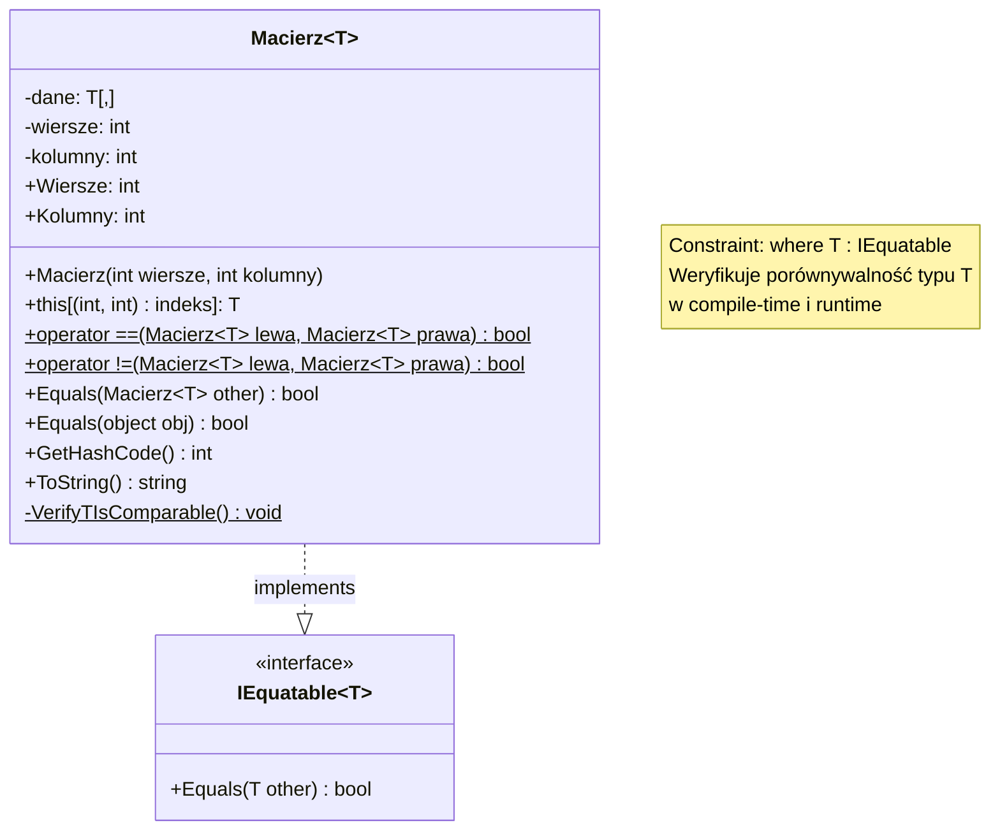

# Zadanie 3 - Klasa Macierz<T>

## Opis zadania

Zdefiniować klasę `Macierz<T>` z następującymi składowymi:

### Konstruktor

- Przyjmujący wymiar wierszy i wymiar kolumn
- Tworzący nową tablicę dwuwymiarową odpowiednich rozmiarów i typu komórek

### Indeksator

- Z getterem i setterem
- **Dwuwymiarowe indeksy**
- Powinien być typ `(int, int)` lub `(uint, uint)` jako typ indeksu

### Operatory porównania

#### `operator ==` i `operator !=`

- Sprawdza wymiar porównywanych macierzy
- Przy zgodnym wymiarze porównuje wszystkie komórki

### Interfejsy

#### `IEquatable<Macierz<T>>`

- Implementacja działająca zgodnie z operatorem `==`

### Dodatkowe wymagania

- **Dodatkowe punkty** za weryfikację, czy `T` jest porównywalne z `T`

## Diagram klasy



## Szczegóły implementacji

### Pola prywatne

- **`dane`** - tablica dwuwymiarowa `T[,]` przechowująca elementy macierzy
- **`wiersze`** - liczba wierszy macierzy (readonly)
- **`kolumny`** - liczba kolumn macierzy (readonly)

### Implementacja konstruktora

#### `Macierz(int wiersze, int kolumny)`

Tworzy nową macierz o określonych wymiarach.

- **Walidacja parametrów**: sprawdza czy `wiersze > 0` i `kolumny > 0`
- **Weryfikacja typu T**: wywołuje `VerifyTIsComparable()` dla dodatkowych punktów
- **Inicjalizacja**: tworzy tablicę `T[wiersze, kolumny]` z wartościami domyślnymi

### Właściwości

#### `Wiersze` i `Kolumny` (tylko do odczytu)

- **Źródło**: zwracają wartości pól `wiersze` i `kolumny`
- **Typ zwracany**: `int`
- **Bezpieczeństwo**: readonly - wymiary nie mogą być zmienione po utworzeniu

#### Indeksator `this[(int wiersz, int kolumna) indeks]`

- **Typ indeksu**: `ValueTuple (int, int)` zgodnie z wymaganiami zadania
- **Getter**: zwraca element na pozycji `[wiersz, kolumna]`
- **Setter**: ustawia element na pozycji `[wiersz, kolumna]`
- **Walidacja**: sprawdza czy indeksy są w zakresie, rzuca `IndexOutOfRangeException` w przypadku błędu
- **Destructuring**: używa `var (wiersz, kolumna) = indeks` dla czytelności

### Implementacja operatorów porównania

#### `operator ==(Macierz<T> lewa, Macierz<T> prawa)`

Porównuje dwie macierze pod kątem równości.

- **Sprawdzenie referencji**: `ReferenceEquals()` dla optymalizacji
- **Obsługa null**: sprawdza czy żadna z macierzy nie jest `null`
- **Porównanie wymiarów**: najpierw porównuje rozmiary macierzy
- **Porównanie elementów**: iteruje przez wszystkie elementy używając `EqualityComparer<T>.Default.Equals()`

#### `operator !=(Macierz<T> lewa, Macierz<T> prawa)`

- **Implementacja**: deleguje do `!(lewa == prawa)` dla spójności

### Implementacja interfejsu IEquatable<T>

#### `Equals(Macierz<T> other)`

- **Implementacja**: wykorzystuje operator `==` zgodnie z wymaganiami
- **Spójność**: zapewnia zgodność między `Equals()` a operatorem `==`

#### `Equals(object obj)` (override)

- **Pattern matching**: używa `obj is Macierz<T> other` dla bezpiecznego rzutowania
- **Delegowanie**: przekazuje wywołanie do typowanej wersji `Equals()`

### Weryfikacja typu T

#### `VerifyTIsComparable()` (metoda prywatna statyczna)

- **Sprawdzenie interfejsu**: używa `IsAssignableFrom()` dla weryfikacji `IEquatable<T>`
- **Sprawdzenie metody**: weryfikuje obecność metody `Equals(T)`
- **Komunikat**: wyświetla potwierdzenie weryfikacji
- **Wyjątki**: rzuca `InvalidOperationException` przy błędach weryfikacji

### Dodatkowe metody

#### `GetHashCode()` (override)

Generuje hash code dla macierzy.

- **Algorytm**: rozpoczyna od `HashCode.Combine(wiersze, kolumny)`
- **Kombinowanie**: dla każdego elementu używa `HashCode.Combine(hash, dane[i, j])`
- **Cel**: zapewnia spójność z metodą `Equals()` dla kolekcji hashowanych

#### `ToString()` (override)

Zwraca czytelną reprezentację macierzy.

- **Format**: każdy wiersz w nawiasach kwadratowych `[elem1, elem2, elem3]`
- **Separatory**: elementy oddzielone przecinkami i spacjami
- **Nowe linie**: wiersze oddzielone znakami nowej linii
- **Optymalizacja**: używa `StringBuilder` dla wydajności
- **Null safety**: obsługuje `null` elementy wyświetlając `"null"`

### Obsługa błędów

Klasa rzuca następujące wyjątki:

- **`ArgumentException`**: gdy wymiary ≤ 0 w konstruktorze
- **`IndexOutOfRangeException`**: gdy indeksy są poza zakresem macierzy
- **`InvalidOperationException`**: gdy typ T nie implementuje `IEquatable<T>` (weryfikacja runtime)

### Przykład użycia

```csharp
// Tworzenie macierzy różnych typów
var macierzLiczb = new Macierz<int>(2, 3);
var macierzTekstów = new Macierz<string>(2, 2);

// Wypełnianie przez indeksator ValueTuple
macierzLiczb[(0, 0)] = 1;
macierzLiczb[(0, 1)] = 2;
macierzLiczb[(1, 0)] = 3;

// Porównywanie macierzy
var macierz2 = new Macierz<int>(2, 3);
macierz2[(0, 0)] = 1;
macierz2[(0, 1)] = 2;
macierz2[(1, 0)] = 3;

bool równe = macierzLiczb == macierz2; // true
bool różne = macierzLiczb != macierz2; // false
```
